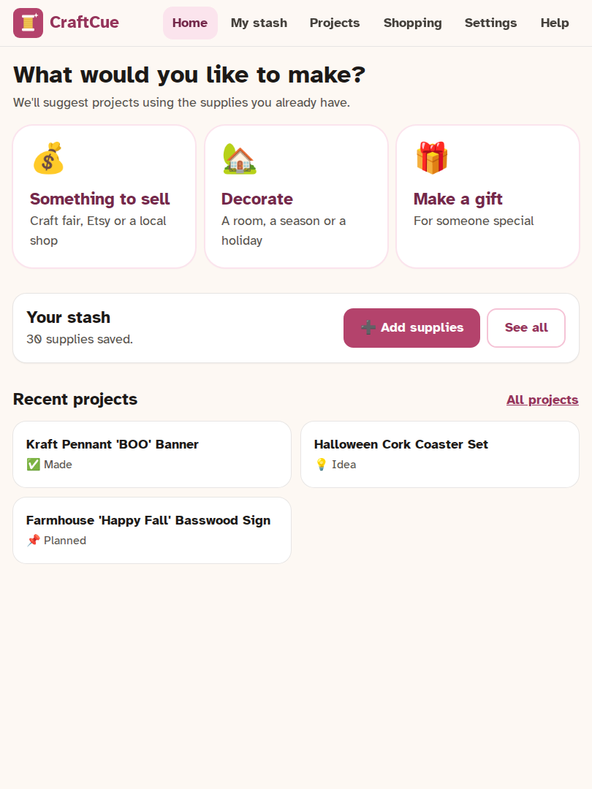
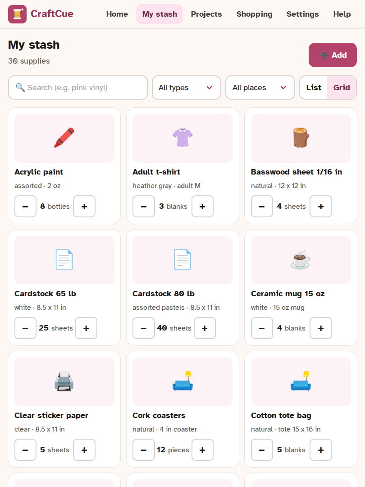
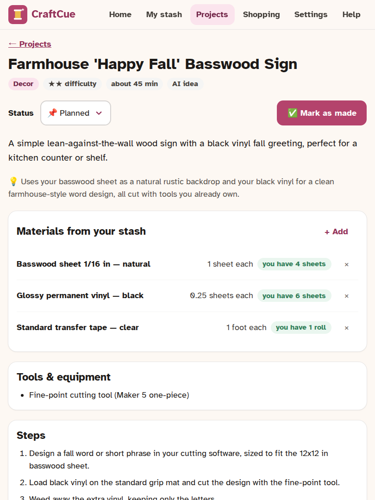

# CraftCue

**What can I make with what I already have?**

CraftCue keeps track of your craft supplies, the tools you own for your cutting machine, and your
other equipment, then suggests projects you can make from your own stash: something to **sell**,
something to **decorate** with, or a **gift** for someone.

👉 **Open it:** https://terrylackey243.github.io/craftcue/

Nothing to install and no account to make. On an iPhone or iPad, tap Share → *Add to Home Screen*
to keep it one tap away. On Android or a computer, use *Install app*.

<p>
  
  
  
</p>

## What it does

- **Your stash.** Add supplies by scanning a barcode, snapping a photo, typing them in, or
  photographing a whole shelf at once. Search, filter, and tap + / − as you use things.
- **Project ideas.** Pick Sell, Decorate or Make a gift, answer a couple of questions, and get
  ideas grouped into **Make it now** (you have everything) and **Needs one more thing**.
- **It knows your machine.** Ideas never assume a blade or tool you don't own, or a material too
  wide or thick for your cutter.
- **Projects and shopping.** Save ideas, follow the steps, and tap *Mark as made* to take the
  supplies out of your stash. Anything missing goes on a shareable shopping list.
- **Gift list.** Save the people you make things for, so ideas fit them and never repeat.

CraftCue does **not** make cut files. You build the design in Cricut Design Space (or your
machine's software), using the search terms and tips each idea gives you.

### Supported machines

Cricut Maker 5, Maker 4, Maker 3, Explore 5, Explore 4, Explore 3, Joy Xtra, Joy, Silhouette
Cameo 5, Brother ScanNCut DX, and "another cutting machine" where you enter the size limits
yourself. Profiles marked *details not double-checked yet* in the app still need confirming
against the manufacturer's help pages. [Help us check them](CONTRIBUTING.md#adding-or-checking-a-machine).

## Privacy

- Everything is stored **only in your browser, on your device**. There are no accounts, no
  analytics and no tracking.
- The only time anything leaves your device is when you use a smart feature: your request (and
  your supply list, or the photo you took) goes straight from your browser to Anthropic. The
  optional extra abilities send only your description (and chosen colors) to OpenAI or Recraft.
- **Back up now and then** (Settings → Backup & restore). Browsers, especially on iPhone and iPad,
  can clear saved data when space runs low. The app reminds you.

## Smart suggestions (optional)

Everything except suggestions and photo reading works with no setup at all. The smart features
use **Claude** from Anthropic, with your own API key, paid directly to Anthropic:

- A round of 5 ideas costs about **4–7 cents** (Standard quality).
- Reading a photo costs **well under a cent**.

**Designs:** Claude lays out a cut-ready design (fonts, shapes, icons, botanicals) that CraftCue
draws itself, with a mock-up, cut layers and a Design Space SVG (about 2–5 cents).

**Extra abilities (optional, each with its own key):**

- *Illustrated stickers* with OpenAI images (about 6 cents a picture), laid out as a Print Then
  Cut sticker sheet.
- *Illustrated vinyl art* with Recraft (about 8 cents a design), drawn only in the vinyl colors
  you pick and split into one cut layer per color.

The in-app guide (Help → *Setting up smart suggestions*) walks you through it with pictures:
[docs/ai-key-guide.md](docs/ai-key-guide.md).

## Accounts and sync (coming)

The public version keeps everything on your device. Accounts, so your stash follows you between
your computer, tablet and phone and survives a lost device, are built and being tested on a
private copy first. They're optional in the code, so you can also run your own copy with sync:
see [CONTRIBUTING.md](CONTRIBUTING.md#accounts-and-sync).

## Run your own copy

It's a static site. Any web server works:

```bash
cp compose.example.yml compose.yml
docker compose up -d --build   # → http://localhost:8080
```

Installing the app and using it offline need HTTPS, so put it behind your usual HTTPS proxy.
Developers: see [CONTRIBUTING.md](CONTRIBUTING.md).

## Credits

Designs are drawn with open-license fonts from Google Fonts (SIL Open Font License 1.1 and Apache
2.0; see `public/licenses/`) and [Phosphor Icons](https://phosphoricons.com) (MIT). Cut shapes,
lettering and icons in exported files may be used for items you sell.

## Disclaimer

CraftCue is an independent open-source project. It is **not affiliated with or endorsed by
Cricut, Silhouette, Brother, Anthropic, OpenAI or Recraft**. Brand and machine names are used only to describe
compatibility. AI ideas are suggestions: check sizes, materials and safety before you start.

## License

[MIT](LICENSE)
