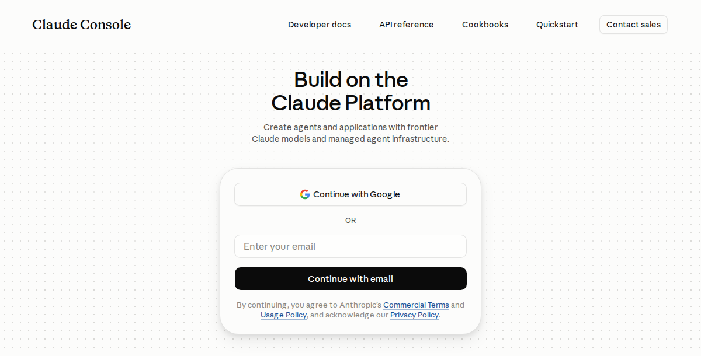
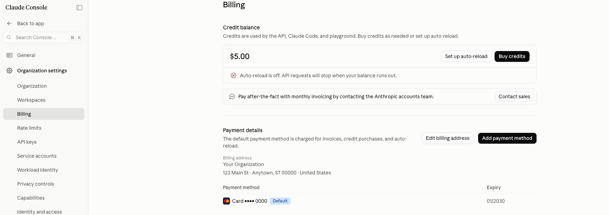
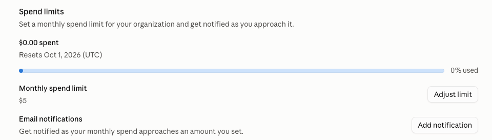
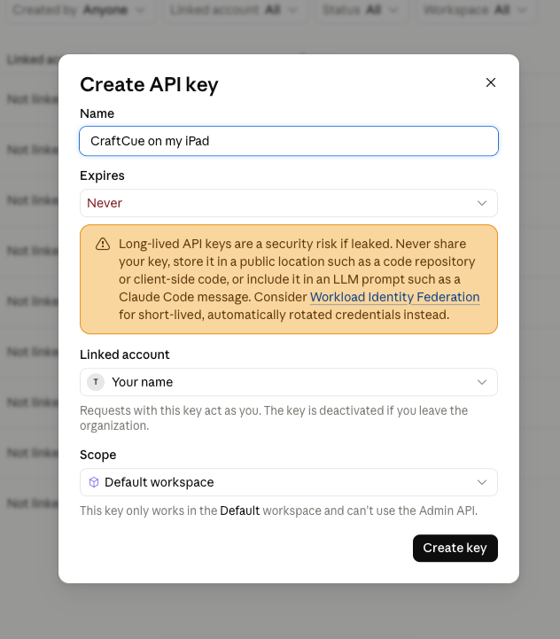

# Setting up smart suggestions

CraftCue's smart features (project ideas and reading photos) use **Claude**, an AI made by
Anthropic. Instead of a subscription, you pay Anthropic directly for what you use, from a
prepaid balance. It takes about 10 minutes, once.

**What it costs:** a round of 5 ideas is about 4–7 cents on the Standard quality setting, and
reading a photo is well under a cent. $5 of credit goes a long way. CraftCue shows an
estimate of this month's use in Settings.

The same steps, with pictures, are inside the app: **Help → Setting up smart suggestions**.

## 1. Create an Anthropic Console account

Go to [platform.claude.com](https://platform.claude.com) and sign up with your email or Google
account. It's free. This is separate from the Claude chat app, but you can use the same email.

## 2. Add some credit

In the menu on the left, choose **Billing**. Tap **Buy credits**, add a card and buy a small
amount ($5 is plenty to start). You pay ahead of time; leave auto-reload off and you can't be
charged more than you put in.

## 3. Set a monthly spending limit (recommended)

Scroll down the same Billing page to **Spend limits**, tap **Adjust limit**, and set a small
monthly limit such as $5. If it's ever reached, smart features pause until next month.

## 4. Create an API key

Choose **API keys → Create key**. If a box about "identity federation" appears, choose
**Continue with an API key**. Then:

- **Name:** something like "CraftCue on my iPad"
- **Expires:** **Never** (a 30-day key stops working next month). A yellow warning about keeping
  keys safe appears; that's expected, and your spend limit protects you.
- **Scope:** **Default workspace**

Tap **Create key** and copy it straight away. It starts with `sk-ant-` and is **shown only once**.

## 5. Paste it into CraftCue

In CraftCue, go to **Settings → Smart suggestions**, paste the key, and tap **Test and save key**.

### Keep your key private

Anyone with your key can spend your credits. CraftCue stores it only on your device and sends it
only to Anthropic. Don't save it on a shared or public computer. If you think someone has it,
delete it in the Console and make a new one. **Settings → Forget my key** removes it from CraftCue.
